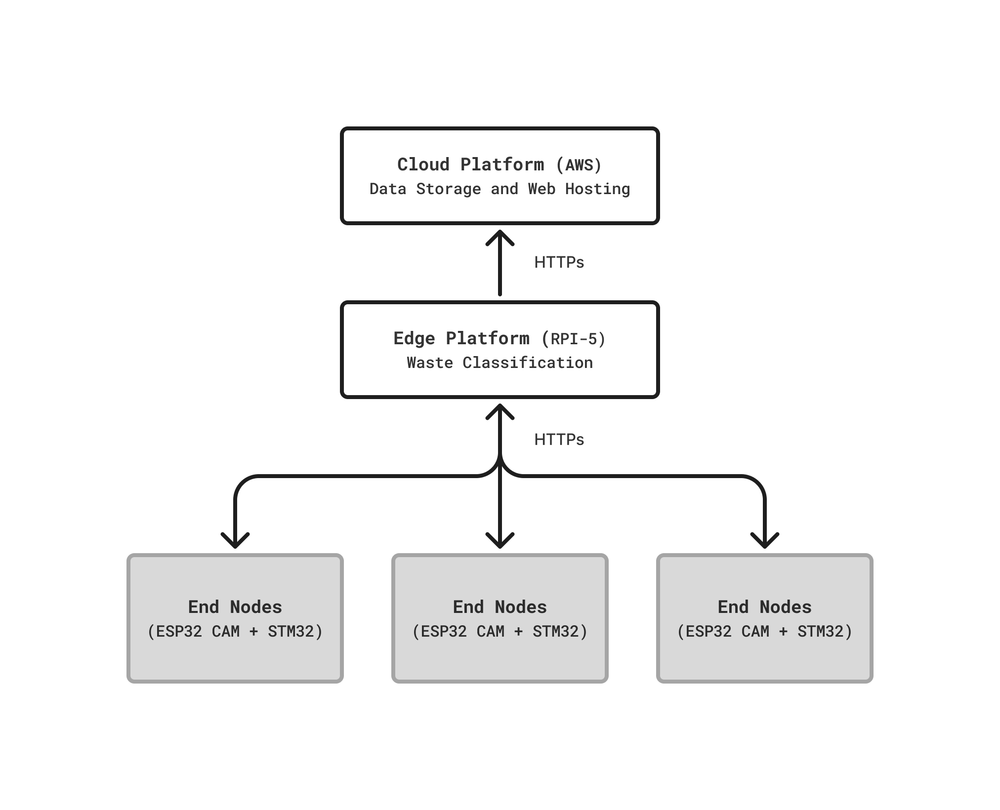
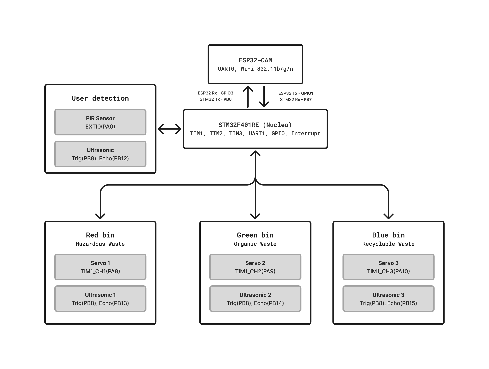
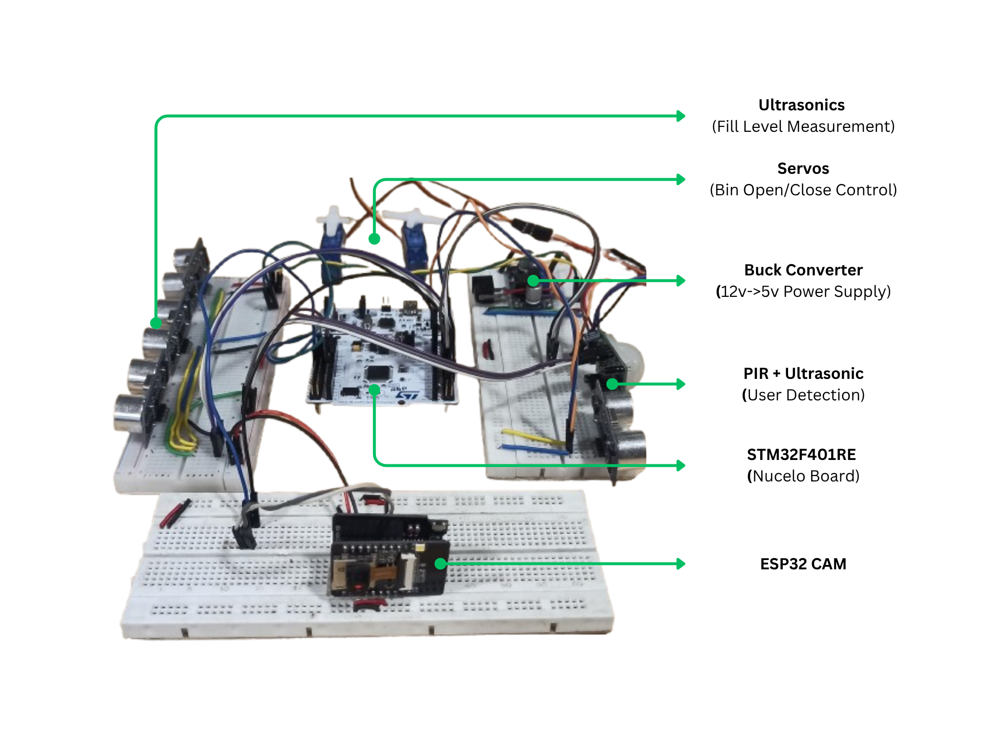
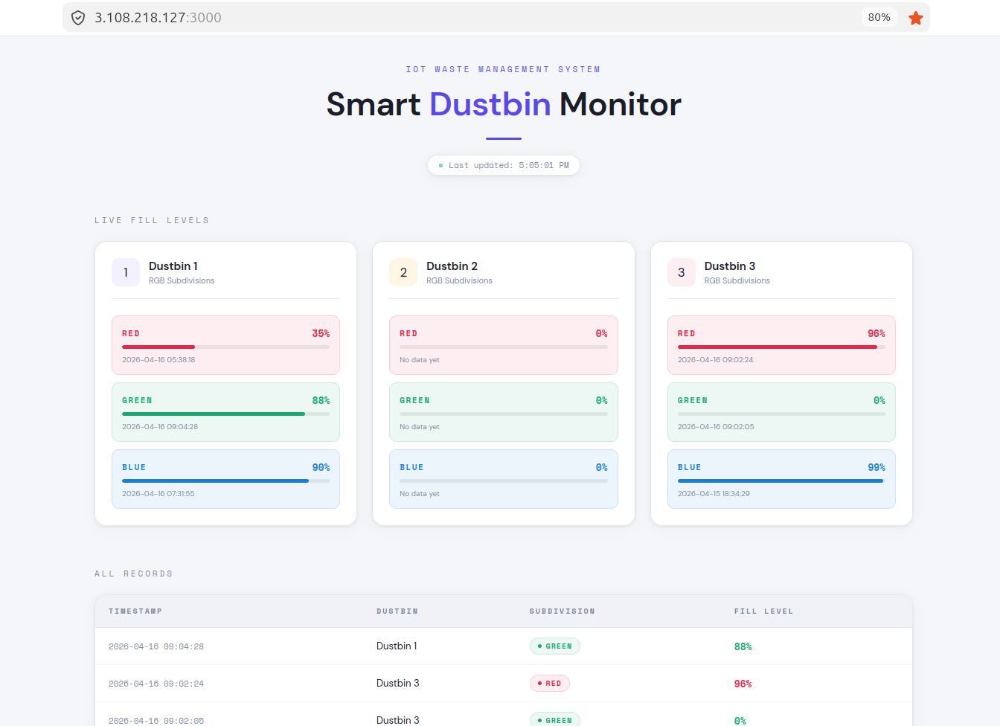

# IoT Bin

**An IoT-powered smart waste segregation system with automatic bin opening, real-time fill level monitoring, and AI-based waste classification.**

## Table Of Contents

- [Overview](#overview)
- [System architecture](#system-architecture)
- [Hardware components](#hardware-components)
- [Pin configuration](#pin-configuration)
- [Communication protocol](#communication-protocol)
- [Project structure](#project-structure)
- [Dashboard](#dashboard)

---

## Overview

The Smart IoT-Bin Monitor is a three-bin IoT waste segregation system. When a user approaches, a PIR sensor triggers the STM32 to confirm proximity via ultrasonic, then signals the ESP32-CAM to capture an image. The image is sent to a Raspberry Pi 5 edge node for AI classification — identifying the waste as **red** (hazardous), **green** (organic), or **blue** (recyclable). The STM32 opens the correct bin's servo, waits 5 seconds, closes it, measures the fill level via ultrasonic, and reports it back up the chain to an AWS-hosted dashboard.

---

## System Architecture

### End-To-End Block Diagram


Three end nodes (each an ESP32-CAM + STM32 pair) connect to a single Raspberry Pi 5 edge node over WiFi/HTTPs. The edge node runs the waste classification model and relays fill level data to the AWS server, which hosts both the SQLite database and the web dashboard.

### End Node Internal Block Diagram



Inside each end node, the STM32F401RE is the central controller. It manages three servo motors and three ultrasonic sensors (one per bin), plus a PIR sensor and a dedicated ultrasonic for user detection. The ESP32-CAM connects over UART and handles WiFi communication with the edge node.

---

## Hardware components



| Component | Quantity | Purpose |
|---|---|---|
| STM32F401RE Nucleo | 1 per node | Main controller — servos, ultrasonics, PIR, UART |
| ESP32-CAM (AI-Thinker) | 1 per node | Image capture + WiFi communication |
| HC-SR04 Ultrasonic | 4 per node | 3× fill level (one per bin) + 1× user detection |
| HC-SR501 PIR sensor | 1 per node | User presence detection |
| MG90S Servo motor | 3 per node | Bin lid actuation |
| Raspberry Pi 5 | 1 (shared) | Edge computing — waste image classification |
| AWS EC2 instance | 1 (shared) | SQLite database + web dashboard hosting |
| 5V power supply | 1 per node | Powers STM32, ESP32-CAM, sensors, servos |

---

## Pin configuration

### STM32F401RE

#### UART
| Signal | Pin |
|---|---|
| UART1 TX (→ ESP32-CAM RX) | PB6 |
| UART1 RX (← ESP32-CAM TX) | PB7 |

#### Servo motors (TIM1 PWM)
| Bin | Pin | Waste type |
|---|---|---|
| Servo 1 — Red bin | PA8 (TIM1_CH1) | Hazardous waste |
| Servo 2 — Green bin | PA9 (TIM1_CH2) | Organic waste |
| Servo 3 — Blue bin | PA10 (TIM1_CH3) | Recyclable waste |

#### Ultrasonic sensors (TIM2 + GPIO)
| Sensor | Trigger | Echo | Purpose |
|---|---|---|---|
| User detection | PB8 | PB12 | Confirm user within 25 cm |
| Ultrasonic 1 (Red) | PB8 | PB13 | Red bin fill level |
| Ultrasonic 2 (Green) | PB8 | PB14 | Green bin fill level |
| Ultrasonic 3 (Blue) | PB8 | PB15 | Blue bin fill level |

> All ultrasonics share a single trigger pin (PB8). Echo pins are read individually to multiplex measurements.

#### PIR sensor
| Signal | Pin | Interrupt |
|---|---|---|
| PIR output | PA0 | EXTI0 (rising edge) |

### ESP32-CAM (AI-Thinker)
| Signal | GPIO | Notes |
|---|---|---|
| UART0 TX (→ STM32 PB7) | GPIO1 | Default UART0 — dedicated to STM32 |
| UART0 RX (← STM32 PB6) | GPIO3 | Default UART0 — dedicated to STM32 |

---

## Communication protocol

All messages are ASCII strings terminated with `\n`.

### STM32 → ESP32-CAM

| Message | Meaning |
|---|---|
| `READY\n` | STM32 boot complete — sent once at startup |
| `PIR_DETECT\n` | User confirmed within 25 cm — take a photo |
| `DIST:xx\n` | Measured user distance in cm (diagnostic) |
| `ACK1\n` / `ACK2\n` / `ACK3\n` | Bin command received, servo opening |
| `FILL1:xx\n` / `FILL2:xx\n` / `FILL3:xx\n` | Fill level percent after bin closes |
| `TIMEOUT\n` | ESP32-CAM did not respond within 3 seconds |
| `ERR\n` | Unknown command received |

### ESP32-CAM → STM32

| Message | Meaning |
|---|---|
| `B1\n` | Open bin 1 (Red — hazardous) |
| `B2\n` | Open bin 2 (Green — organic) |
| `B3\n` | Open bin 3 (Blue — recyclable) |
| `ERR\n` | Classification failed |

### ESP32-CAM → Edge (Raspberry Pi 5)

Image is sent as a multipart HTTP POST to the edge node's classification endpoint. The edge node returns a JSON response indicating the waste class.

### Edge (Raspberry Pi 5) → AWS

Fill level data is forwarded as an HTTPs POST:

```json
POST /api/fill
{
  "node_id": 1,
  "bin": "red",
  "fill_percent": 75,
  "timestamp": "2026-04-16T09:04:28Z"
}
```

---

## Project structure

```
.
├── Archive
│   └── Images
├── Documents
│   ├── ESP32
│   ├── OV03660-A51A_datasheet.pdf
│   └── STM32F401RE
├── Edge_Platform
│   ├── bin_fill_status.json
│   ├── edge_server.py
│   ├── requirement.txt
│   └── yolov8n.pt
├── Firmwares
│   ├── ESP32_Archive
│   ├── ESP32_Firmware
│   ├── STM32_Archive
│   └── STM32_Firmware
├── README.md
├── Server
│   ├── cert.pem
│   ├── index.html
│   ├── instance
│   ├── key.pem
│   └── server.py
├── Test
│   ├── http_img_post.sh
│   ├── NodeRed
│   ├── test1.jpg
│   └── test.jpg
└── Third_Party
    ├── CMSIS
    ├── esp32-camera
    ├── FreeRTOS
    ├── path_config.xml
    └── WS
```

---

## Dashboard

The web dashboard is hosted on the AWS EC2 instance.



It shows:
- Live fill levels for each dustbin node with colour-coded progress bars (red, green, blue subdivisions)
- Last-updated timestamp with live polling
- Full records table with timestamp, dustbin, subdivision, and fill level

---